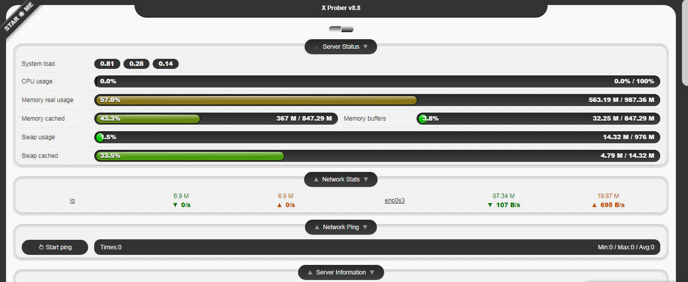
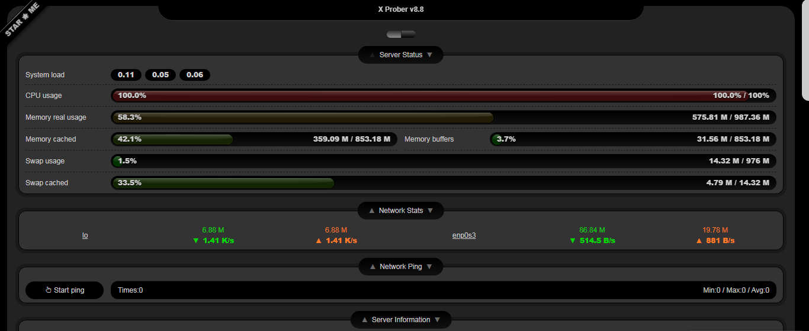
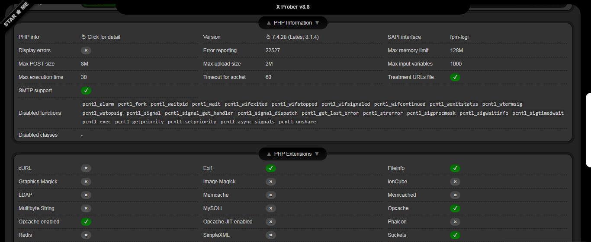

<!--
N.B.: This README was automatically generated by https://github.com/YunoHost/apps/tree/master/tools/README-generator
It shall NOT be edited by hand.
-->

# x-prober for YunoHost

[](https://dash.yunohost.org/appci/app/x-prober)    
[](https://install-app.yunohost.org/?app=x-prober)

*[Lire ce readme en français.](./README_fr.md)*

> *This package allows you to install x-prober quickly and simply on a YunoHost server.
If you don't have YunoHost, please consult [the guide](https://yunohost.org/#/install) to learn how to install it.*

## Overview

This is a probe program for PHP environment. It can show your server information and readable easily.

[](https://raw.githubusercontent.com/kmvan/x-prober/master/screenshots/preview.webp)

[](screenshots/01.jpg)

[](screenshots/02.jpg)

[](screenshots/03.jpg)


**Shipped version:** 8.8~ynh1

**Demo:** https://prober.inn-studio.com/

## Screenshots





## Disclaimers / important information

This is a probe program for PHP environment. It can show your server information and readable easily.

more info here

https://github.com/kmvan/x-prober/blob/master/README.md

## Documentation and resources

* Official app website: https://prober.inn-studio.com/
* Official user documentation: https://github.com/kmvan/x-prober
* Upstream app code repository: https://github.com/kmvan/x-prober
* YunoHost documentation for this app: https://yunohost.org/app_x-prober
* Report a bug: https://github.com/YunoHost-Apps/x-prober_ynh/issues

## Developer info

Please send your pull request to the [testing branch](https://github.com/YunoHost-Apps/x-prober_ynh/tree/testing).

To try the testing branch, please proceed like that.
```
sudo yunohost app install https://github.com/YunoHost-Apps/x-prober_ynh/tree/testing --debug
or
sudo yunohost app upgrade x-prober -u https://github.com/YunoHost-Apps/x-prober_ynh/tree/testing --debug
```

**More info regarding app packaging:** https://yunohost.org/packaging_apps